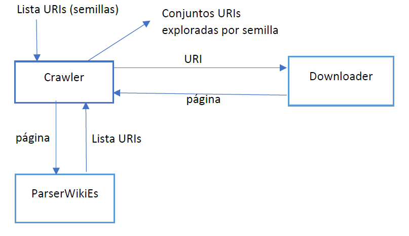

# What does CrawlerWikipedia?
CrawlerWikipedia can download documents from wikipedia, parses wikipedia internal URLs in those documents and fetch them over and over up to a given limit.
* CrawlerWikipedia uses Breadth-first search algorithm in order to crawl the web pages.
* Saves the result of crawling in a log file

# Usage
Run src/test/TestCrawler.java whith the syntax and arguments: `TestCrawler limit [-f file|-u url] [-n|-t time]`

# Architecture (in Spanish)

* Downloader: descarga el contenido de la página a partir de una URI. Se puede configurar un retardo para espaciar las descargas en el tiempo.
* Crawler: ejecuta un algoritmo de búsqueda en anchura con control de nodos repetidos para explorar los enlaces obtenidos de cada página.
* ParserWikiEs: a partir del contenido html de una página parsea los enlaces y los filtra para devolver solo los enlaces internos a contenidos de es.wikipedia.org.

# Constraints (in Spanish)
* Se puede configurar un límite máximo de enlaces explorados:
    * Si a partir de una semilla se llega al límite de enlaces explorados, no se exploran más semillas.
    * Si no, se siguen explorando otras semillas hasta alcanzar el límite de enlaces. Es decir, se explora hasta que: (total de enlaces de todas las semillas) == límite
* Para evitar volver a explorar enlaces que ya se han visitado se utiliza como estructura de datos un conjunto para almacenar los enlaces explorados a partir de una semilla. Antes de visitar un nuevo enlace se comprueba que no esté ya en el conjunto de visitados.
* El método start() de la clase Crawler comienza con la exploración, para recuperar los resultados se usa el método writeLogs() que genera un archivo .log por cada semilla que se ha usado para explorar con el contenido:
    * 1º línea: enlace semilla
    * 2º línea: tiempo en segundos que ha durado la exploración de la semilla
    * 3º línea: número de enlaces visitados a partir de la semilla
    * 4º y resto de líneas: enlaces explorados a partir de la semilla
* La clase Crawler tiene el método start() sobrecargado con un argumento para indicar el tiempo en segundos que quiere permanecer explorando en cada semilla.

# Page content analysis (in Spanish)
1. Se utiliza el patrón: `<\\s*a[^>]*href=\"(?<href>.*?)\"[^>]*>.*?\\s*\\/\\s*a`
Para recuperar cada etiqueta `<a href=”…”>` del contenido html de la página.
2. Mediante un grupo extraemos el texto del recurso al que apunta cada enlace.
2. Aplicamos al texto obtenido el patrón: `^\\/wiki\\/[^\\.:\\/]*$`
para quedarnos solo con los enlaces relativos jerárquicos que comienzan con /wiki/nombre_documento, donde nombre_documento no contiene el carácter dos puntos (:) o punto (.).
Filtrando los que no tienen (:) aseguramos que no nos quedamos con enlaces internos que no apuntan a documentos como por ejemplo “/wiki/Ayuda:Contenidos”.
Filtrando los que no tienen un punto (.) nos aseguramos que no nos quedamos con los que apuntan a imágenes u otros tipos de recurso.
4. La cadena resultante se separa por el carácter # para descartar la parte “fragment” de la URI.

# Performance (in Spanish)
A partir de la semilla: [Transact-SQL](https://es.wikipedia.org/wiki/Transact-SQL) y con un límite de 30000 enlaces, se ha llegado al límite de 30000 enlaces explorados. Se ha tardado 2 horas y 36 minutos.